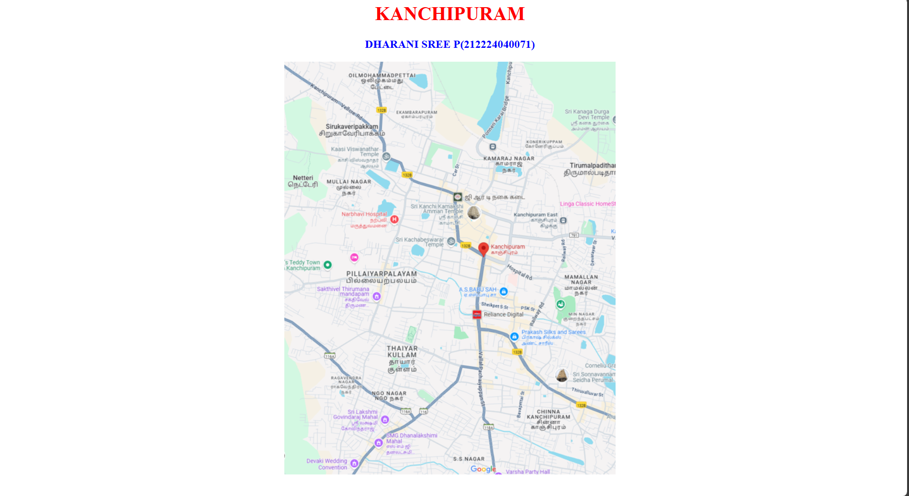
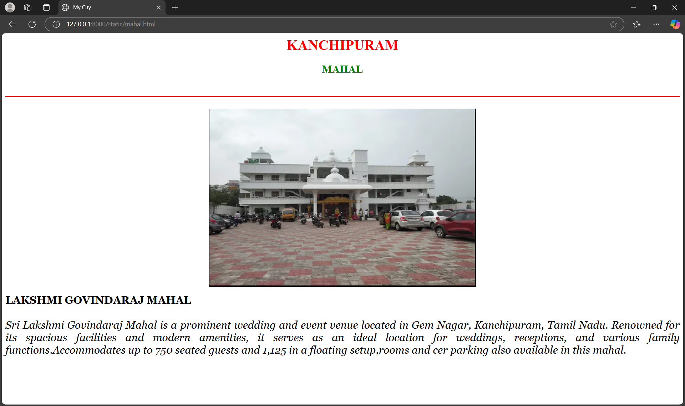
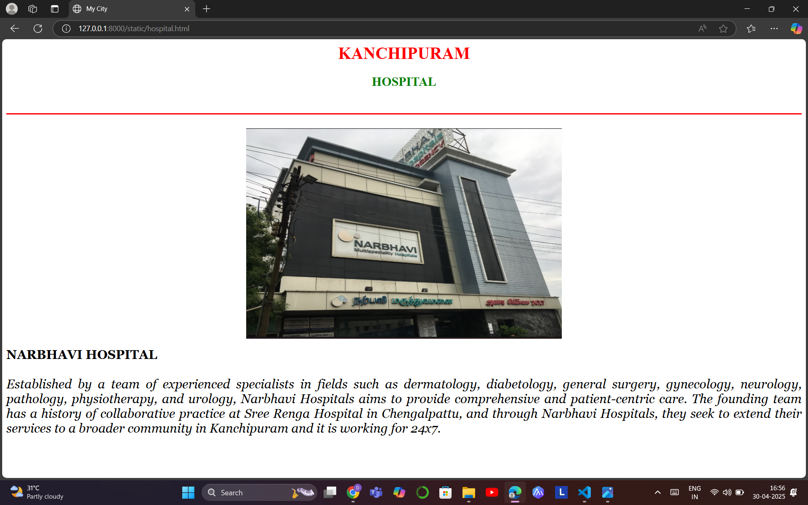

# Ex04 Places Around Me
## Date:30/04/2025

## AIM
To develop a website to display details about the places around my house.

## DESIGN STEPS

### STEP 1
Create a Django admin interface.

### STEP 2
Download your city map from Google.

### STEP 3
Using ```<map>``` tag name the map.

### STEP 4
Create clickable regions in the image using ```<area>``` tag.

### STEP 5
Write HTML programs for all the regions identified.

### STEP 6
Execute the programs and publish them.

## CODE
```
map.html
<html>
    <head>
        <title>My City</title>
    </head>
    <body>
        <h1 align="center">
            <font color="red"><b>KANCHIPURAM</b></font>
        </h1>    
        <h3 align="center">
            <font color="blue"><b>DHARANI SREE P(212224040071)</b></font>
        </h3>
        <center>
            
            <map name="image-map">
                <area target="" alt="temple" title="temple" href="templt.html" coords="210,239,302,270" shape="rect">
                <area target="" alt="hospital" title="hospital" href="hospital.html" coords="99,250,118,277,164,278,173,242" shape="poly">
                <area target="" alt="mahal" title="mahal" href="mahal.html" coords="122,593,45" shape="circle">
            </map>
        </center>
    </body>
</html>        


temple.html
<html>
    <head>
        <title>MyCity</title>
    </head>
    <body>
        <h1 align="center">
            <font color="red"><b>KANCHIPURAM</b></font>
        </h1>
        <h2 align="center">
            <font color="green"><b>KAMAKSHI AMMAN TEMPLE</b></font>
        </h2>
        <br>
        <hr size="3" color="red">
        <br>
        <center>
        </center>
        <p align="justify">
            <font face="Georgia" size="4" color="black">
            <b>KAMAKSHI AMMAN TEMPLE</b>
            <br>
            <br><i>
                The Kamakshi Amman Temple, also known as Kamakoti Nayaki Kovil,is a Hindu temple dedicated to the goddess Kamakshi, one of the highest aspects of Adi Parashakti, the supreme goddess in Shaktism. The temple is located in the historic city of Kanchipuram, near Chennai, India.It may have been founded in the 5th-8th century CE by the Pallava kings,whose capital was in Kanchipuram. It may also have been built by the Cholas in the 14th century,and legend also says it was built as recent as 1783.The temple is one of the most important centers of Shaktism in the state of Tamil Nadu. The temple is dedicated mainly to Kamakshi, but also has a shrine for Vishnu, in his form of Varaha.Kamakshi is worshipped in the shrine in five forms.The temple is also the center for the Kanchi Kamakoti Peetham.</i>
            </font>
        </p>
    </body>
</html>

mahal.html

<html>
    <head>
        <title>My City</title>
    </head>
    <body>
        <h1 align="center">
            <font color="red"><b>KANCHIPURAM</b></font>
        </h1>
        <h2 align="center">
            <font color="green"><b>MAHAL</b></font>
        </h2>
        <br>
        <hr size="3" color="red">
        <br>
        <center>
        </center>
        <p align="justify">
            <font face="Georgia" size="5" color="black">
            <b>LAKSHMI GOVINDARAJ MAHAL</b>
            <br>
            <br><i>
                Sri Lakshmi Govindaraj Mahal is a prominent wedding and event venue located in Gem Nagar, Kanchipuram, Tamil Nadu. Renowned for its spacious facilities and modern amenities, it serves as an ideal location for weddings, receptions, and various family functions.Accommodates up to 750 seated guests and 1,125 in a floating setup,rooms and cer parking also available in this mahal.</i>

            </font>
        </p>
    </body>
</html>

hospital.html

<html>
    <head>
        <title>My City</title>
    </head>
    <body>
        <h1 align="center">
            <font color="red"><b>KANCHIPURAM</b></font>
        </h1>
        <h2 align="center">
            <font color="green"><b>HOSPITAL</b></font>
        </h2>
        <br>
        <hr size="3" color="red">
        <br>
        <center>
        </center>
        <p align="justify">
            <font face="Georgia" size="5" color="black">
            <b>NARBHAVI HOSPITAL </b>
            <br>
            <br><i>
                Established by a team of experienced specialists in fields such as dermatology, diabetology, general surgery, gynecology, neurology, pathology, physiotherapy, and urology, Narbhavi Hospitals aims to provide comprehensive and patient-centric care. The founding team has a history of collaborative practice at Sree Renga Hospital in Chengalpattu, and through Narbhavi Hospitals, they seek to extend their services to a broader community in Kanchipuram and it is working for 24x7.</i>
            </font>
        </p>
    </body>
</html>
```

## OUTPUT









 
## RESULT

The program for implementing image maps using HTML is executed successfully.
